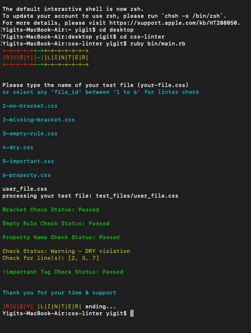

# CSS-Linters

[](https://repl.it/@YigitMersin/CSS-Linter#bin/main.rb)

[](https://github.com/yigitm/css-linter/issues)
[](https://github.com/yigitm/ruby-linter/pulls)
[](https://www.gnu.org/licenses/gpl-3.0)


---

## 🧐 About

This is a simple CSS linter that focusing on Ruby's some best practices by checking the Linter cases based on some common mistakes that almost every beginner developer experienced.

Users can test their own css by adding their css file to "test_files" folder and after installing it to thier local machine, they can use the application from their terminal.

---

# 🔧 Built with

- [Ruby](https://rubyonrails.org/)

- [Ruby Gem - Colorize](https://rubygems.org/gems/colorize/versions/0.8.1)

- [RSpec - For Testing](https://rspec.info/)

# Live Version:

Without installing it to your local machine, you can run the live version:

[](https://repl.it/@YigitMersin/CSS-Linter#bin/main.rb)

If you wish to test your own css file, please follow below 'Installing' instructions.

# 🛠 Install

#### Step - 1

Ruby should be installed in your local machine. Please check this [article](https://rubyonrails.org/) how to install/setup Ruby for iOS or Windows.

#### Step - 2

To get a local copy of the repository please run the following commands on your terminal.

If you are not familiar to use terminal, please check this [article](https://www.theodinproject.com/courses/web-development-101/lessons/command-line-basics-web-development-101)

```
cd <your_local_folder>
```

```
git clone git@github.com:git@github.com:yigitm/css-linter.git
```

```
cd css-linter
```

#### Step - 3

In order to run the gem files _(necessary third party files for execution of the programme)_ . Please type below command:

```
run bundle install
```

##### Step - 4

Type in the following command to run the linter on a test file

```
ruby bin/main.rb
```

# Testing for your own CSS file

For testing your own css file after installing it to your local machine,please add your file to test_files folder and run the application from the terminal with;

```
cd path_to_your_folder
```

Programme console will prompt you to type your file name in: "file.css" format.



# Testing for Code

Test class methods using RSpec by running the command in your root directory

```
rspec
```

Before testing for using RSpec you can install the gem file by running the command

```
$ gem install rspec
```

# Style Guide <a name = "styleguide"></a>

## 1. Errors for Syntax

<p>These 'Errors' lints are checking the cases syntax errors</p>

#### - Mising Bracket(s) Case

<b>#bracket_checker</b> lint is checking the missing curly brackets. It displays an error message.

```
.some-title {
  font-weight: lighter;

.some-other-title {
  color: red;
  font-weight: lighter;
}
```

#### - Using Regular Bracket(s) or No Bracket(s)

This lint is checks the case of mixing curly bracket(s) with regular bracket(s) or typing no bracket(s). It displays an error message.

```
# bad
.some-title
  font-weight: lighter;

.some-other-title (
  color: red;
  font-weight: lighter;
)

# good
.some-title {
  font-weight: lighter;
}

.some-other-title {
  color: red;
  font-weight: lighter;
}
```

#### - Empty Rule

This lint is checks the case of leaving empty rule(s). It displays an error message.

```
# bad
.some-title {
}

.{
}

# good
.some-title {
  color: red;
}

.some-other-title {
  font-weight: lighter;
}
```

#### - Missing colon: or semi-colon;

This lint is checks the missing colon(s) or semi-colon(s). It displays an error message.

```
# bad
.some-title {
  color red;
}

.some-other-title {
  font-weight: lighter
}

# good
.some-title {
  color: red;
}

.some-other-title {
  font-weight: lighter;
}
```

## 2. Warnings for good practices

<p>These 'Warning' lints are checking the cases of good CSS practices of using fewer tags and violation of DRY rule

#### - Over use of !important Tag

This lint is checks the over use of !important tag. It displays a warning message if tag is used more than ten.

```
# bad
.some-title {
  color: red !important;
}

.some-other-title {
  font-weight: lighter !important;
}
...usage limit is '10'

# good

...using !important tag less than '10' times
```

#### - DRY (Dont Repeat Yourself) Violation

This lint is checks the DRY rule violations. It displays a warning message.

```
# bad

.some-title {
  font-weight: lighter;
  color: red;
}

.some-other-title {
  font-weight: lighter;
}

# good

.some-title, .some-other-title {
  font-weight: lighter;
}

.some-title {
  color: red;
}
```

## ✒️ Author

👤 **Yiğit Mersin**

- Github: [@yigitm](https://github.com/yigitm)
- Twitter: [@yigitmersin](https://twitter.com/ygtmrsn)
- Linkedin: [ygtmrsn](https://www.linkedin.com/in/yigitmersin)

## 🤝 Contributing

Contributions, issues and feature requests are welcome!

Feel free to check the [issues page](https://github.com/yigitm/ruby-linter/issues).

## 👍 Show your support

Give a ⭐️ if you like this project!

## Acknowledgments

Project inspired by [Microverse](https://www.microverse.org/) & [Odin Project](https://www.theodinproject.com/)

## 📝 License :

This project is [GNU GENERAL PUBLIC LICENSE](https://www.gnu.org/licenses/why-not-lgpl.html) licensed.
